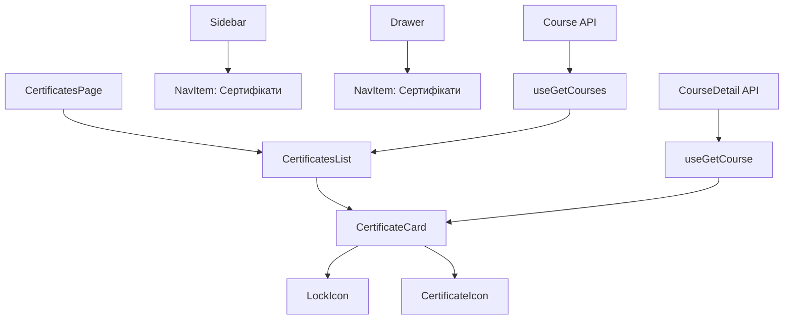

# Секція Сертифікати

## Опис
Нова секція "Сертифікати" в особистому кабінеті, розміщена між секціями "Академія" та "Вебінари".

## Функціональність

### Основні можливості:
- Відображення всіх курсів (придбаних та непридбаних)
- Показ модулів кожного курсу з індикаторами доступності
- Прогрес-бари для відстеження завершення модулів (тільки для придбаних курсів)
- Детальний список уроків з позначенням доступності
- Кнопки для отримання сертифікатів (тільки для завершених модулів придбаних курсів)
- Індикатори доступності: "Придбано", "Частково", "Заблоковано", "Безплатно"

### Компоненти:

#### 1. `page.tsx`
- Головна сторінка секції сертифікатів
- Використовує захищений маршрут
- Включає сайдбар та основний контент

#### 2. `CertificatesList.tsx`
- Список всіх курсів (придбаних та непридбаних)
- Обробка стану завантаження
- Повідомлення про відсутність курсів

#### 3. `CertificateCard.tsx`
- Картка курсу з детальною інформацією
- Індикатори доступності курсу ("Придбано"/"Не придбано")
- Відображення модулів з можливістю розгортання
- Індикатори доступності модулів ("Доступно"/"Частково"/"Заблоковано")
- Прогрес-бари для курсу та модулів (тільки для доступних)
- Детальний список уроків з індикаторами ("Безплатно"/"Доступно"/"Заблоковано")
- Кнопки отримання сертифікатів з різними станами
- Кастомні іконки для замків та сертифікатів

#### 4. `LockIcon.tsx`
- Кастомна SVG іконка замка в стилі сайту
- Замінює прості емоджі для кращого вигляду

#### 5. `CertificateIcon.tsx`
- Кастомна SVG іконка сертифікату
- Використовується для кнопок отримання сертифікатів

## Стилізація

### Кольорова палітра:
- Основний фон: `#242433`
- Темний фон: `#1D1D2A`
- Основний текст: `#D2D2FF`
- Білий текст: `#FFFFFF`
- Акцентний колір: `#6A56E4`
- Сірий текст: `#58587B`

### Особливості дизайну:
- Використання закруглених кутів (rounded-2xl, rounded-3xl)
- Плавні переходи (transition-colors)
- Адаптивний дизайн
- Консистентність з існуючим стилем сайту

### Індикатори доступності:

#### Курси:
- **"Придбано"** (зелений) - користувач має доступ до всього курсу
- **"Не придбано"** (сірий) - користувач не має доступу до курсу

#### Модулі:
- **"Доступно"** (зелений) - модуль повністю доступний (курс придбано)
- **"Частково"** (синій) - модуль частково доступний (є безплатні уроки)
- **"Заблоковано"** (сірий) - модуль повністю заблокований

#### Уроки:
- **"Безплатно"** (синій) - урок доступний безкоштовно
- **"Доступно"** (зелений) - урок доступний через придбання курсу
- **"Заблоковано"** (сірий) - урок заблокований

## Навігація

### Додано до меню:
- **Сайдбар**: Між "Академія" та "Вебінари"
- **Мобільне меню**: В тому ж порядку
- **Іконка**: `Award` з lucide-react

## API

### Використовувані хуки:
- `useGetCourses()` - отримання списку курсів
- `useGetCourse(id)` - отримання деталей курсу з модулями

### Типи даних:
- `Course` - основна інформація про курс
- `CourseDetail` - детальна інформація з модулями
- `ModuleDetail` - інформація про модуль з прогресом

## Архітектура компонентів

## Майбутні покращення

### Планується додати:
1. Функціональність генерації сертифікатів
2. Завантаження сертифікатів у PDF форматі
3. Попередній перегляд сертифікатів
4. Історія отриманих сертифікатів
5. Поделитися сертифікатами в соціальних мережах
